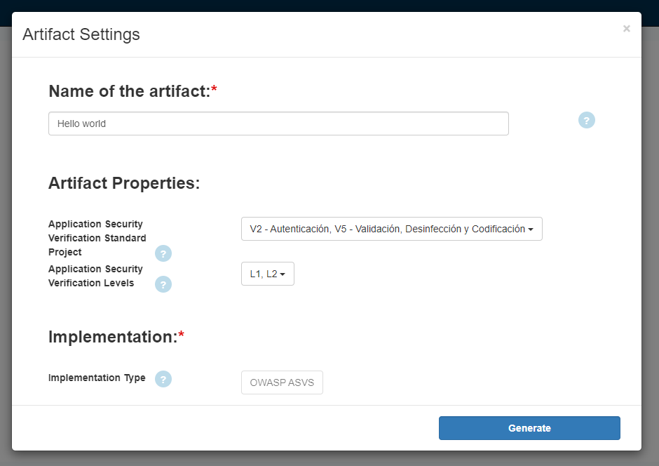
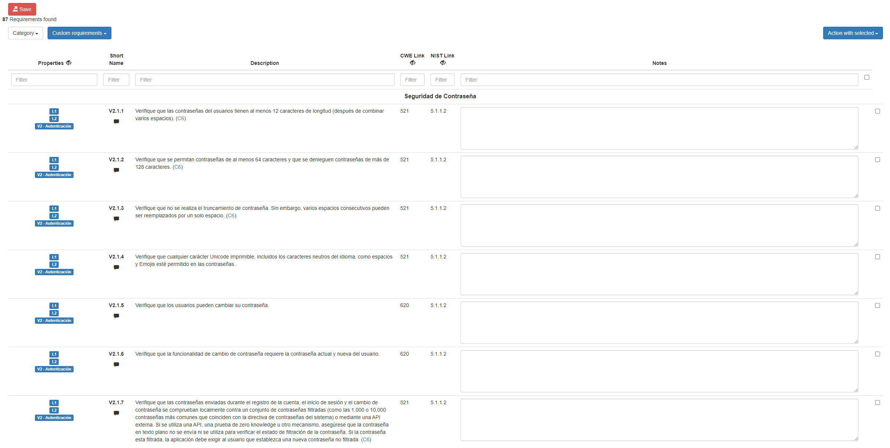

# SecurityRAT-ASVS-Importer


[](https://www.linkedin.com/in/mllamazares/)
[](https://github.com/mllamazares/SecurityRAT-ASVS-Importer/watchers)
[](https://github.com/mllamazares/SecurityRAT-ASVS-Importer/stargazers)
[](https://twitter.com/intent/tweet?text=Check%20out%20SecurityRAT-ASVS-Importer%21%20https%3A%2F%2Fgithub.com%2Fmllamazares%2FSecurityRAT-ASVS-Importer)

Script to generate and import ASVS controls to SecurityRAT in the blink of an eye.

**TL;DR** If you just need the ASVS requirements in SQL format and don't care about the script, go [the output folder](./sql/output). 😉

## Rationale

[SecurityRAT](https://securityrat.github.io/) (*"Security Requirement Automation Tool"*) is a tool helping you manage security requirements in your agile development projects.
In a nutshell, you specify the properties of an application (usually, we use the name "artifact") that you’re developing. Based on these properties, the tool gives you a list of security requirements you should fulfill. [^1]

At the time of writting, there are no scripts (that I know) to automate the generation and importation of ASVS security controls into SecurityRAT tool.

Importing ASVS controls manually has the following drawdowns:
1. Time consuming: 4.0.3 version of ASVS contains nearly 300 security controls.
2. Prone to human mistakes.

The SecurityRAT creators also released the [SecurityRAT-Requirements](https://github.com/SecurityRAT/Security-Requirements) repository that contains SQL dumps ready to import.

Potential improvements:
1. The ASVS controls are not updated to the last version.
2. They are just in English language, and the current ASVS version is also available in Spanish and Simplified Chinese.
3. You need to import them manually.

### Features

The current script try to address the avobe points of improvements with the following features:

* Fetchs the latest ASVS version available.
* Choose among the available languages (English, Spanish or Simplified Chinese).
* Automatically imports all requirements into SecurityRAT specifying a container with a running DB instance.
* It just takes ~4 seconds to perform all the tasks! 🏎️

## Installation and usage

```bash
git clone https://github.com/mllamazares/SecurityRAT-ASVS-Importer
cd SecurityRAT-ASVS-Importer
chmod +x secrat_asvs_importer.sh
bash secrat_asvs_importer.sh -h
```

### Quick-start guide

1. Install SecurityRAT (preferably using [Docker](https://github.com/SecurityRAT/SecurityRAT-dockercompose)):
    ```bash
    git https://github.com/SecurityRAT/SecurityRAT-dockercompose.git
    cd SecurityRAT-dockercompose
    docker-compose up
    ```
2. In a different session, clone this repo and open the folder:
    ```bash
    git clone https://github.com/mllamazares/SecurityRAT-ASVS-Importer
    cd SecurityRAT-ASVS-Importer
    ``` 
3. Once the step 1 has finished, auto-import the latest ASVS Spanish version to SecurityRAT pointing at the DB container:
    ```
    $ bash secrat_asvs_importer.sh -l es -d securityrat-mariadb
    [+] Searching latest ASVS relase...
    The lastest ASVS version is 4.0.3
    [+] Downloading the es version of ASVS in CSV format...
    ./csv/asvs_4.0.3_es.csv file downloaded!
    [+] Creating SQL dump with the required configuration...
    ./sql/output/secrat_asvs_final_4.0.3_es.sql file generated!
    [+] Loading SQL requirements into SecurityRAT database...
    [+] All done! Bye!
    ``` 

To verify that the requirements are indeed loaded:
1. Go to http://localhost:9002/ and log in with `admin/admin` (yep, you should change this in the future).
2. Click on `Define a new artifact`.
3. Select the ASVS chapter and level that you need and smash the `Generate` button.
    
4. There you go! Now you have an updated version of the ASVS controls in Spanish:
    

### Options

```
    NAME
        SecurityRAT ASVS Importer

    DESCRIPTION
        - Small script to import ASVS controls to SecurityRAT in the blink of an eye.
        - GitHub: https://github.com/mllamazares/SecurityRAT-ASVS-importer
        - Author: https://www.linkedin.com/in/mllamazares/

    SYNOPSIS
        ./secrat_asvs_importer.sh [OPTIONS]

    OPTIONS
        -l <language> 
            The language of the ASVS controls. Avaiable options are en, es or zh-cn. Default is en
        -d <securityrat_docker_db_container>
            The running docker container that contains the SecurityRAT database where it will overwrite the requirements.
            Example: securityrat-mariadb
        -h
            Prints this message (duh).
```

## TODO
- [ ] Create a better categorization of the requirements.
- [ ] Migrate to Python for better portability and easing collaboration.
- [ ] Extend to different security standards like BSI C5.

[^1]: Extracted from https://securityrat.github.io/